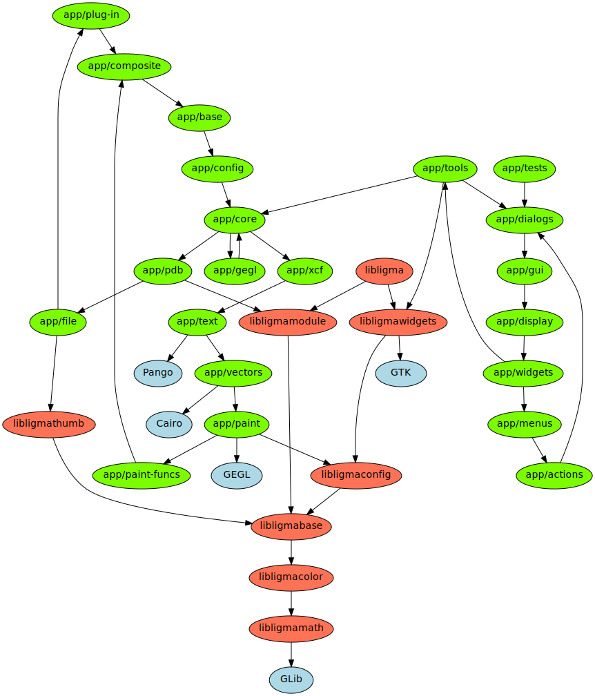

# This file is read-only, please check https://developer.gimp.org

All the developer documentation is exclusively hosted on
[GIMP Developer website](https://developer.gimp.org/).

The `devel-docs` dir only contains some branch-specific information that
can not be hosted on the developer website, which is mainly the
**os-support.txt** file and the **modules explanation** below.

{height=1120px}.

GIMP source tree can be divided into the main application, libraries, plug-ins,
data files and some stuff that don't fit into these categories. Here are the
top-level directories:

| Folder          | Description |
| ---             | ---         |
| app/            | Source code of the main GIMP application                                              |
| app-tools/      | Source code of distributed tools                                                      |
| build/          | Scripts for creating binary packages                                                  |
| data/           | Data files: dynamics, gradients, palettes…                                            |
| desktop/        | Desktop integration files                                                             |
| devel-docs/     | Developers documentation generation files                                             |
| docs/           | CLI and rc files documentation (manpages)                                             |
| etc/            | Configuration files installed with GIMP                                               |
| extensions/     | Source code of extensions                                                             |
| gimp-data/      | Raster or image data files                                                            |
| **libgimp/**    | Library for plug-ins (core does not link against) (**can have auto-generated files**) |
| libgimpbase/    | Basic functions shared by core and plug-ins                                           |
| libgimpcolor/   | Color-related functions shared by core and plug-ins                                   |
| libgimpconfig/  | Config functions shared by core and plug-ins                                          |
| libgimpmath/    | Mathematic operations useful for core and plug-ins                                    |
| libgimpmodule/  | Abstracts dynamic loading of modules (used to implement loadable color selectors and display filters) |
| libgimpthumb/   | Thumbnail functions shared by core and plug-ins                                       |
| libgimpwidgets/ | User interface elements (widgets) and utility functions shared by core and plug-ins   |
| menus/          | XML/XSL files used to generate menus                                                  |
| modules/        | Color selectors and display filters loadable at run-time                              |
| pdb/            | Scripts for PDB source code generation                                                |
| plug-ins/       | Source code for plug-ins distributed with GIMP                                        |
| po/             | Translations of strings used in the core application                                  |
| po-libgimp/     | Translations of strings used in libgimp                                               |
| po-plug-ins/    | Translations of strings used in C plug-ins                                            |
| po-python/      | Translations of strings used in Python plug-ins                                       |
| po-script-fu/   | Translations of strings used in Script-Fu scripts                                     |
| po-tags/        | Translations of strings used in tags                                                  |
| po-tips/        | Translations of strings used in tips                                                  |
| po-windows-installer/ | Translations of strings used in the Windows installer                           |
| themes/         | Official themes                                                                       |
| tools/          | Source code for non-distributed GIMP-related tools                                    |
| .gitlab/        | Gitlab-related templates or scripts                                                   |

The source code of the main GIMP application is found in the `app/` directory:

| Folder          | Description |
| ---             | ---         |
| app/actions/    | Code of actions (`GimpAction*` defined in `app/widgets/`) (depends: GTK)         |
| app/config/     | Config files handling: GimpConfig interface and GimpRc object (depends: GObject) |
| app/core/       | Core of GIMP **core** (depends: GObject)                                         |
| app/dialogs/    | Dialog widgets (depends: GTK)                                                    |
| app/display/    | Handles displays (e.g. image windows) (depends: GTK)                             |
| app/file/       | File handling routines in **core** (depends: GIO)                                |
| app/file-data/  | GIMP file formats (gbr, gex, gih, pat) support (depends: GIO)                    |
| app/gegl/       | Wrapper code for babl and GEGL API (depends: babl, GEGL)                         |
| app/gui/        | Code that puts the user interface together (depends: GTK)                        |
| app/menus/      | Code for menus (depends: GTK)                                                    |
| app/operations/ | Custom GEGL operations (depends: GEGL)                                           |
| app/paint/      | Paint core that provides different ways to paint strokes (depends: GEGL)         |
| **app/pdb/**    | Core side of the Procedural Database, exposes internal functionality. (**can have auto-generated files**) |
| app/plug-in/    | Plug-in handling in **core**                                                     |
| app/propgui/    | Property widgets generated from config properties (depends: GTK)                 |
| app/tests/      | Core unit testing framework                                                      |
| app/text/       | Text handling in **core**                                                        |
| app/tools/      | User interface part of the tools. Actual tool functionality is in core           |
| app/vectors/    | Vectors framework in **core**                                                    |
| app/widgets/    | Collection of widgets used in the application GUI                                |
| app/xcf/        | XCF file handling in **core**                                                    |

This README file is read-only.

Remember: all the developer documentation is exclusively hosted on
[GIMP Developer website](https://developer.gimp.org/). Do
not search nor add documentation files on this dir.
