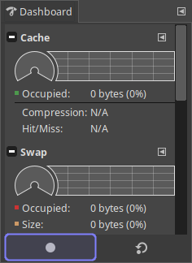
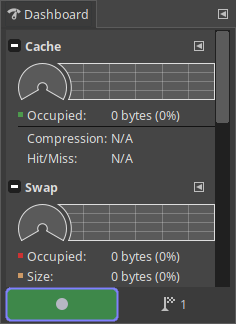
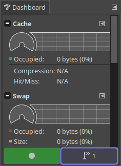
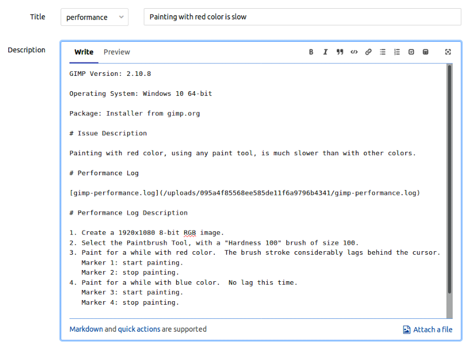
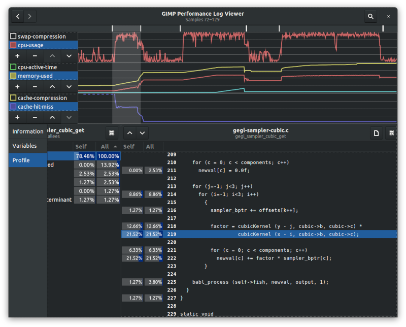

# Performance Logs

GIMP 2.10.8 and above has the ability to record *performance logs* containing
detailed information about the run-time behavior of the program, helping
locating and analyzing performance bottlenecks.

This document describes how to record and view performance logs, and how to
report performance-related issues.

## Table of Contents

  - [1. Recording Performance Logs](#1-recording-performance-logs)
    - [1.1. Event Markers](#11-event-markers)
  - [2. Reporting Performance-Related Issues](#2-reporting-performance-related-issues)
  - [3. What Information is Contained in the Log?](#3-what-information-is-contained-in-the-log)
  - [4. Viewing Performance Logs](#4-viewing-performance-logs)
    - [4.1. Sample-Selection Area](#41-sample-selection-area)
      - [4.1.1. Selecting Samples](#411-selecting-samples)
    - [4.2. Information Area](#42-information-area)
      - [4.2.1. Information Page](#421-information-page)
      - [4.2.2. Markers Page](#422-markers-page)
      - [4.2.3. Variables Page](#423-variables-page)
      - [4.2.4. Backtrace Page](#424-backtrace-page)
        - [4.2.4.1. Threads Pane](#4241-threads-pane)
        - [4.2.4.2. Stack Pane](#4242-stack-pane)
      - [4.2.5. Profile Page](#425-profile-page)
        - [4.2.5.1. Root Column](#4251-root-column)
          - [4.2.5.1.1. Thread Filter](#42511-thread-filter)
          - [4.2.5.1.2. Call-Graph Direction](#42512-call-graph-direction)
        - [4.2.5.2. Function Columns](#4252-function-columns)
        - [4.2.5.3. Source Columns](#4253-source-columns)
    - [4.3. Selection Modifiers](#43-selection-modifiers)
      - [4.3.1. Searching Samples](#431-searching-samples)
    - [4.4. History Navigation](#44-history-navigation)
    - [4.5. Environment Variables](#45-environment-variables)
  - [5. Performance-Log Parameters](#5-performance-log-parameters)

## 1. Recording Performance Logs

Performance logs track the program state while the program is normally running.
In the usual case, you would record a performance log while performing a task
whose performance you wish to optimize, or against which you wish to report a
performance-related bug.
The recorded log can then be used to investigate the run-time behavior of the
program during the execution of the task.

To record a performance log, open the *Dashboard* dockable (*Windows ▸
Dockable Dialogs ▸ Dashboard*), click the *Record* button at the
bottom of the dockable, and select a filename for the log.
The *Record* button will subsequently change its color, indicating that the log
is being recorded.

At this point, you should perform the task of interest as you normally would,
while state information is being recorded.
The log contains periodic samples of the program state during execution, and it
is therefore important to keep performing the task long enough (possibly
repeating it multiple times) so that a sufficiently large number of samples is
collected.
30 seconds or more is a good amount of time (longer periods improve the quality
of the log, while increasing its size).

When you're done performing the task, stop recording the log by pressing the
*Record* button again.
At this point, GIMP will perform any necessary final steps, which may take a
while (usually, no more than a few seconds).
At the end of this process, the log is ready.

### 1.1. Event Markers

When the recorded task is made up of multiple steps, it is useful to have an
indication of where the different steps begin and end within the log.
This is achieved using *event markers*.
An event marker is an annotated time-point in the log, signifying the
occurrence of an event of interest, such as the beginning or end of a logical
step.
It is up to you to add event markers to the log, as you see necessary.

To add an event marker, click the *Add Marker* button at the bottom of the
Dashboard dockable, next to the *Record* button, and enter a short description
for the corresponding event.
(Note that the *Add Marker* button is only available while a log is being
recorded.)
You may also click the button while holding the *Shift* key, to add an *empty*
event marker, not containing a description; this is useful when event markers
are needed to be added quickly.

Event markers are numbered sequentially, and may be referred to by their
number (this is especially useful for empty event markers.)
The number of the next event marker (the one that will be added when the button
is clicked) is displayed on the *Add Marker* button.

## 2. Reporting Performance-Related Issues

When reporting a performance-related issue, use the
[*performance* template][new-performance-issue] in GIMP's GitLab issue
tracker.
Provide a detailed description of the task you were performing, and attach a
performance log.
If the performance log is too big, attach a compressed version.
If you've added any empty event markers to the log, provide a description for
these markers in the report.

Note that the log alone, while containing plenty of low-level information,
doesn't in itself explain *what* you were doing, nor does it contain all the
relevant details, so please *do* take time to describe the issue in addition to
the log.
Attaching a screencast of the process, possibly *while* recording the log, can
also be very helpful.

## 3. What Information is Contained in the Log?

The log consists mainly of a series of periodic *samples* of the program state.
(The default sampling rate is 10 samples per second; see
[section *5*](#5-performance-log-parameters) for a way to modify this value.)
Each sample contains the values of all the *instrumentation variables*
displayed in the Dashboard.
Additionally, on supported platforms, each sample contains a full *program
backtrace*.
(Backtraces are currently supported on Linux and Windows; their level of detail
might depend on the available libraries and build-time options.)
When debugging information is available, corresponding source-location
information is included.

Additionally, the log contains certain global information, not related to any
sample.
This includes GIMP version information, performance-log parameters (such as the
sampling rate), GEGL configuration parameters (such as the tile size), and the
values of all environment variables starting with `GIMP_`, `GEGL_`, or `BABL_`.

## 4. Viewing Performance Logs

The GIMP source tree includes a graphical viewer for performance logs, under
the `tools/` directory.
The viewer is not included as part of GIMP installations, but is distributed as
part of source tarballs.

To view a performance log, run:

    $GIMP_SRC_DIR/tools/performance-log-viewer $LOG_FILE

where `$GIMP_SRC_DIR` is the root of the GIMP source tree, and `$LOG_FILE` is
the log filename.

Note that there is no need to build or install GIMP in order to use the log
viewer.
Indeed, only the files prefixed with `performance-log` in the `tools/`
directory are actually needed.
The log viewer does require, however, a POSIX-compatible shell, Python 3,
PyGObject, and GTK+ 3 (including gir bindings).

The rest of this section describes how to use the log viewer.

### 4.1. Sample-Selection Area

The upper part of the viewer window is the *sample-selection area*.
It consists of one or more graphs, visualizing a selected subset of the
instrumentation variables at each sample.
A variable list to the left of each graph is used to select the set of
variables to be visualized.
The list is searchable by variable name, and its tooltip shows the variable
descriptions.
A row buttons below the list allows adding, removing, and reordering the
graphs.

Note that all variables visualized by the same graph share the same scale.
It therefore makes sense to visualize variables that measure related
quantities, such as `cache-occupied` and `swap-occupied`, using a single graph,
while visualizing variables that measure unrelated quantities, such as
`cache-occupied` and `cpu-usage`, using separate graphs.
Boolean variables, such as `cpu-active`, are an exception, and always use the
full height of the graph, regardless of the other variables they are visualized
along.

A dashed line in a graph indicates that the corresponding variable's value is
infinite.
A missing line in part of the graph indicates that a measurement of the
corresponding variable is not available at the corresponding samples.

Event markers are displayed as ticks above the graphs, at the nearest sample.

Hovering over the sample-selection area displays a tooltip, showing the current
sample index, the time at which it was taken relative to the start of the log,
the values of all visualized variables at the current sample, and the
descriptions for all event markers corresponding to the current sample, if any.

#### 4.1.1. Selecting Samples

In addition to visualizing the instrumentation variables, the sample-selection
area is used to select a subset of the samples, referred to as the current
*selection*, which affects the data displayed in the information area,
described below.
The samples included in the current selection are highlighted on the graphs,
and a textual description of the current selection appears in the window's
titlebar.

A single sample can be selected by clicking any of the graphs at the
corresponding area.
Multiple samples can be selected by clicking and dragging.
Entire spans of samples enclosed between a pair of event markers can be
selected by double-clicking, or double-clicking and dragging.
*Shift*, *Ctrl*, and *Shift+Ctrl* can be used as modifiers in order to
add-to, subtract-from, and intersect-with the current selection, respectively.

Samples can also be selected using the keyboard, with the arrow, *Home*/*End*,
and *Shift* keys, while any of the graphs has focus.

Right-clicking on any of the graphs, or pressing *Escape* while they have
focus, clears the selection.
The behavior when the selection is empty is equivalent to selecting all
samples.

*Ctrl*-right-clicking on any of the graphs inverts the selection.

### 4.2. Information Area

The lower part of the viewer window is the *information area*.
It consists of multiple *pages* showing different data, generally relating to
the current selection of samples.

#### 4.2.1. Information Page

The *information page* shows global information contained in the log, not
associated with any sample, including:

  - *Log Parameters*:
    Various parameters relating to the performance log itself.
    See [section *5*](#5-performance-log-parameters) for more information.

  - *GIMP Version*:
    Verbose GIMP version information, as reported by `gimp -v`.

  - *Environment*:
    A list of environment variables for the GIMP process recording the log,
    starting with `GIMP_`, `GEGL_`, or `BABL_`.
    These environment variables directly affect the behavior of GIMP.

  - *GEGL Config*:
    A list of all the properties of the `GeglConfig` object of the GIMP process
    recording the log.

The key/value lists are searchable by key name.

#### 4.2.2. Markers Page

The *markers page* lists the event markers contained in the log, displaying
their number, relative time, and description.
It is only present in logs containing event markers.

If the current selection contains samples corresponding to any markers, the
markers are selected in the markers-page list.  Conversely, if any markers are
selected in the markers-page list, the corresponding samples are selected.

#### 4.2.3. Variables Page

The *variables page* shows instrumentation-variable statistics for the current
selection.

When a single sample is selected, the current values of all variables are
listed, both in a formatted form, and in raw form as appears in the log file.
The formatted form is usually more convenient, while the raw form is more
precise.

When multiple samples are selected, a number of statistics are listed for each
variables, taken over the selected set of samples.
This includes the minimum, maximum, and median values, the mean, and the
standard deviation.

The variable list is searchable by variable name, and its tooltip shows the
variable descriptions.

#### 4.2.4. Backtrace Page

The *backtrace page* shows the program backtrace at the current sample.
It is only available when a single sample is selected, in logs containing
backtraces.

##### 4.2.4.1. Threads Pane

The *threads pane*, on the left side of the page, lists all active threads at
the time of the sample, displaying the following information:

  - *ID*:
    The operating-system numeric thread-ID, uniquely identifying the thread.

  - *Name*:
    The descriptive thread name.
    Note that not all threads may be named, or the name may not be available on
    some platforms.

  - *State*:
    The thread's state.
    May be one of:

      - *`R`*:
        The thread is in a *running* state, executing code on the CPU.

      - *`S`*:
        The thread is in a *sleeping* state, not executing any code.
        This may include various types of non-running states on different
        platforms.

    Note that on some platforms, thread state information may not be fully
    accurate.

The thread list is searchable by thread name.

Double-clicking on a thread selects all samples at which the thread is in the
running state.

##### 4.2.4.2. Stack Pane

The *stack pane*, on the right side of the page, shows the selected thread's
call stack at the time of the sample, displaying the following information:

  - *Frame Number (#)*:
    The stack-frame's nesting level, where 0 is the most-nested frame.

  - *Address*:
    The start address of the function.

  - *Object*:
    The object file containing the function.
    The full path is available in the corresponding tooltip.

  - *Function*:
    The function name.

  - *Offset*:
    The offset of the current instruction, relative to the start of the
    function.

  - *Source*:
    The source file corresponding to the current instruction.
    The full path is available in the corresponding tooltip.

  - *Line*:
    The line number corresponding to the current instruction.

Note that for some frames, only partial information may be available.

When the source file for a given frame is found locally, a *file* icon is shown
at the end of the corresponding row.
The icon's tooltip shows the local path to the source file, and clicking on the
icon opens the file in a text editor, at the corresponding line (when
possible).
See [section *4.5*](#45-environment-variables) for information regarding how to
control local source-file lookup and the selected text editor.

The frame list is searchable by function name.

Double-clicking on a frame selects all samples at which the corresponding
function is present in the backtrace.

#### 4.2.5. Profile Page

The *profile page* shows a fully context-sensitive *call graph*, annotated with
frequency information, for the current selection.
It replaces the backtrace page when multiple samples are selected, in logs
containing backtraces.

The call graph is comprised of all the call stacks at the selected samples.
Note that each sample generally includes multiple call stacks—one per each
thread.
Some call stacks may be filtered out, as described below.

The call graph is traversed using a series of cascading columns (aka *Miller
columns*).
Each non-root column lists the direct *descendants* (*callers* or *callees*) of
a given function; selecting a descendant opens a new column to the right of the
current column, showing the descendants of the selected function, and so on.

##### 4.2.5.1. Root Column

The *root column* of the call graph shows a list of all functions included in
the graph.
The following frequency statistics are shown next to each function:

  - *Self*:
    The number of call stacks in which the function appears at the most-nested
    frame (when the graph direction is *caller → callee*), or at the
    least-nested frame (when the graph direction is *callee → caller*), as a
    percentage of the total number of call stacks.
    When the graph direction is *caller → callee*, this quantity indicates the
    relative amount of time spent executing code belonging exclusively to this
    function.

  - *All*:
    The number of call stacks in which the function appears at any frame, as a
    percentage of the total number of call stacks.
    This quantity indicates the relative amount of time spent executing code
    belonging to this function, or any of its (direct or indirect) descendant,
    and is always greater-than or equal-to *Self*.

By default, the list is sorted by *All*, but it can be sorted by *Self* or by
function name as well.
The list is searchable by function name.
Pressing *Escape* while the list has focus deselects the current item.

The root-column header buttons allow controlling the structure of the call
graph:

###### 4.2.5.1.1. Thread Filter

The *Threads* button opens the *thread filter*, allowing control over which
threads, and which states of each thread, are included in the graph.

The thread filter lists all threads included in the current selection.
Each thread is identified by ID and name, as described in
[section *4.2.4.1*](#4241-threads-pane).
Next to each thread is a row of toggles, corresponding to the different thread
states; only call stacks during which the thread was in one of the active
states are included in the graph.
Clicking on a thread-state column title toggles the entire column.

The thread list can be searched by thread name.

###### 4.2.5.1.2. Call-Graph Direction

By default, the graph direction is *caller → callee*—the direct descendants of
each function are its callees.
The *Call-Graph Direction* button allows toggling the graph between the *caller
→ callee* direction, and the reverse *callee → caller* direction, in which the
direct descendants of each function are its callers.

##### 4.2.5.2. Function Columns

When a function from the root column is selected, a new *function column* opens
to the right of the root column, listing the direct descendants of the
function.
The descendants list has a similar structure to the function list of the root
column.
When a descendant function is selected, a subsequent function column opens to
the right of current column, showing its direct descendants, and so on.
In this manner, the call graph can be traversed according to its current
direction.

Note that the call graph is fully *context-sensitive*.
This means that the listed descendants of the function depend on the current
column's path in the graph, that is, on the call chain leading to the column.

For example, suppose functions `foo1` and `foo2` both call `bar`, which, in
turn, calls `baz1` and `baz2`; however, `bar` only calls `baz1` when called
through `foo1`, and `baz2` when called through `foo2`.
When selecting `foo1` in the root column, in the *caller → callee* direction,
and subsequently selecting `bar` in `foo1`'s column, `bar`'s column will only
list `baz1` as a descendant, since `baz2` is never called by `bar` when it is
called through `foo1`.
Likewise, when selecting `foo2` in the root column, and `bar` in `foo2`'s
column, only `baz2` will be listed in `bar`'s column.

Context-sensitivity extends to the frequency statistics as well:
The only call stacks considered for each descendant are those in which it
appears as part of a call chain matching the current column.
In other words, the statistics are local to the current call chain, and are
generally different from the global statistics for the same functions.

In addition to the function's callees or callers, the descendants list includes
a special *[Self]* item, corresponding to the current function.
It is most useful for its *Self* percentage, which, in the *caller → callee*
direction, indicates the amount of time spent executing code belonging
exclusively to the current function, and not to any of its descendants,
relative to the total amount of time spent executing the function as a whole.
In other words, in non-recursive cases, the sum of *[Self]*'s *Self*
percentage, and the rest of the descendants' *All* percentage, adds up to
100%—the full execution time of the function.

Double-clicking on any of the descendants selects the corresponding function in
the root column, effectively discarding the current call-chain context.
It is especially useful before swapping the graph's direction.

The *Select Samples* button in the column header selects all the samples
corresponding to the current column, that is, all the samples whose call stacks
contribute to column.
The button's tooltip shows a textual description of the samples.

##### 4.2.5.3. Source Columns

When the *[Self]* item of a function column is selected, if the log contains
source-location information for the function, and the corresponding source file
is found locally, a new *source column* opens to the right of the function
column, showing the source code for the function.
Source lines which appear as part of call stacks display similar frequency
statistics to the root- and function-columns, and are referred to as *annotated
lines*.
Similarly to descendants in function columns, annotated lines are also
context-sensitive.

When a source column is opened, the annotated line with the highest *All*
percentage is selected.
The *Previous Annotated Line* and *Next Annotated Line* buttons on the left
side of the column header can be used to quickly navigate between annotated
lines.
The source code is searchable by line number.

The *Select Samples* button in the column header selects all the samples
corresponding to the selected annotated source line.
The button's tooltip shows a textual description of the samples.

The file button in the column header opens the source file in a text editor, at
the selected line, if possible (see
[section *4.5*](#45-environment-variables)).
The button's tooltip shows the full path to the file.

### 4.3. Selection Modifiers

The buttons on the right side of the window's titlebar allow modifying the
selection in various ways:
The *Clear Selection* and *Invert Selection* buttons clear and invert the
selection, respectively.
The *Find Samples* button allows searching for samples, as explained below.

#### 4.3.1. Searching Samples

The *Find Samples* button opens a popover allowing searching for all samples
matching a user-defined condition.
The condition should be a Python expression, evaluating to a boolean value.
The selected samples are those for which the expression evaluates to `True`.

A number of sample-dependent variables and functions are provided:

  - *Instrumentation Variables*:
    All instrumentation variables are available as variables of type `float`.
    Hyphens in variable names are replaced with underscores.

    For example, the expression `cpu_usage > 0.5` matches all samples at which
    the `cpu-usage` variable is greater-than or equal-to 0.5, that is, at which
    CPU usage is above 50%.

  - *`thread (id, state = None)`*:
    The `thread()` function matches all samples whose backtrace contains a
    given thread.

    The `id` argument may be either a thread-ID of type `int`, or a thread name
    of type `str`.
    The argument may be a regular expression, which should fully match the
    thread name.

    The optional `state` argument, if not `None`, may specify a thread state
    (see [section *4.2.4.1*](#4241-threads-pane)).
    Only samples at which the thread is in the given state are matched.
    The argument may be a regular expression, which should fully match the
    thread state.

    For example, the expression `thread ('paint', 'R')` matches all samples at
    which the `paint` thread is in the `R` (*running*) state.

  - *`function (name, id = None, state = None)`*:
    The `function()` function matches all samples whose backtrace contains a
    given function.

    The `name` argument should specify a function name.
    The argument may be a regular expression, which should fully match the
    function name.

    The optional `id` and `state` arguments have similar meaning to the
    corresponding arguments of the `thread()` function, and may be used to
    limit the search to the call stacks of matching threads.

    For example, the expression `function ('gimp_image_.*')` matches all
    samples whose backtrace includes a function beginning with `gimp_image_`,
    that is, one of the `GimpImage` functions.

By default, the matching samples replace the current selection, but they can be
set to *add-to*, *subtract-from*, or *intersect-with* the current selection
instead.

### 4.4. History Navigation

The *Back* and *Forward* buttons on the left side of the window's titlebar
allow moving backward and forward in the viewer's state history.
The viewer state consists of the current selection, and the current call-graph
direction, thread filter, and path.

### 4.5. Environment Variables

The following environment variables are used by the viewer:

  - *`PERFORMANCE_LOG_VIEWER_PATH`*:
    Colon-separated list of paths, under which to look for local source files.
    If the variable is not defined, the current directory is used instead.

    Source files appearing in the log are searched as follows, where the first
    matching file is selected:

      - If the path is absolute, look for the file at the exact location.

      - For each local path in `PERFORMANCE_LOG_VIEWER_PATH`, try concatenating
        the local path and the log path.
        If no such file exists, remove the first component of log path, and try
        again.

  - *`PERFORMANCE_LOG_VIEWER_EDITOR`*:
    The command to use to launch the text editor.
    The special strings `{file}` and `{line}` are replaced with the filename
    and line number, respectively.
    If the variable is not defined, a default text editor is used.

## 5. Performance-Log Parameters

A number of parameters affect performance-log generation.
They may be currently specified as environment variables for GIMP:

  - *`sample-frequency`*:
    The log's sampling frequency, in samples per second.
    The default value is 10 samples per second, but it can be changed using the
    `GIMP_PERFORMANCE_LOG_SAMPLE_FREQUENCY` environment variable.

  - *`backtrace`*:
    Specifies whether backtraces are included in the log.
    By default, backtraces are included on supported platforms (currently,
    Linux and Windows).
    Backtraces may be suppressed by defining the
    `GIMP_PERFORMANCE_LOG_NO_BACKTRACE` environment variable.

[new-performance-issue]: https://gitlab.gnome.org/GNOME/gimp/issues/new?issuable_template=performance
